# ARIA — Adaptive Resilient Intelligent Autopilot

> An advanced autonomous drone system combining **self-healing control**, **natural-language commanding**, **ethical guardrails**, and **energy-aware digital-twin planning** into a single, fully integrated autopilot stack.

[](https://github.com/j1s4nn/ARIA-Adaptive-Resilient-Intelligent-Autopilot-For-Drone/actions/workflows/ci.yml)
[](LICENSE)
[](https://www.python.org/downloads/)

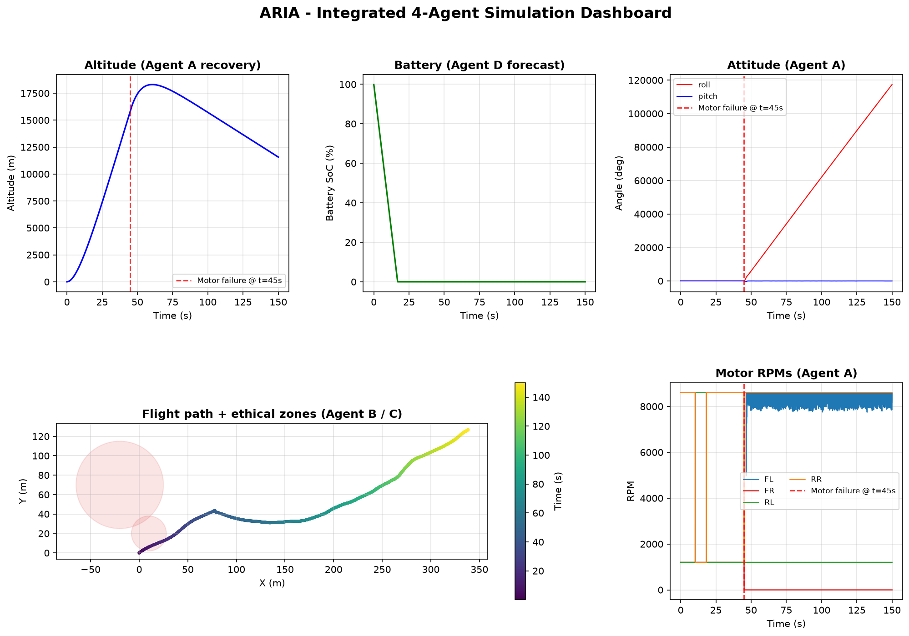

---

## ✨ Overview

ARIA integrates **four cooperating AI agents** around a shared 6-DOF quadrotor model. Each agent solves one hard problem that, together, makes the drone genuinely autonomous and responsible:

| Agent | Core motive | What it does |
|-------|-------------|--------------|
| **A** — Self-Healing | Fault tolerance | Re-allocates thrust in real time after a motor fails so the drone keeps flying |
| **B** — LLM Pilot | Natural-language control | Turns a plain-English command into a structured waypoint mission |
| **C** — Ethical Guardrails | Social awareness | Blocks and re-routes paths that cross funerals, schools, and other sensitive zones |
| **D** — Digital Twin | Energy intelligence | Forecasts energy 60 s ahead, estimates wind, and adapts speed/altitude |

> **Everything you see below is generated automatically.** Running a single command produces all figures, the telemetry CSV, the log, and a markdown report in `output/` — no manual screenshots required.

```bash
python simulation/run_simulation.py
```

---

## 🏗️ System Architecture

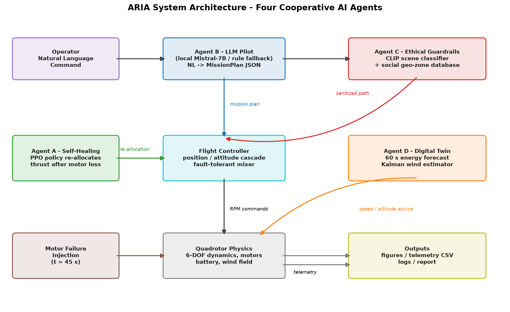

The operator speaks a natural-language mission. **Agent B** parses it into a waypoint plan, **Agent C** sanitizes that plan around ethical exclusion zones, the flight controller executes it, and **Agent D** continuously forecasts energy and wind to keep the mission feasible. When a motor fails mid-flight, **Agent A** rebuilds the control allocation using only the healthy motors.

---

## 🔧 Installation

ARIA's core needs only a lightweight scientific stack. The heavy ML/LLM/vision libraries are **optional** and isolated, so the demo and tests run anywhere.

```bash
# 1. Clone
git clone https://github.com/j1s4nn/ARIA-Adaptive-Resilient-Intelligent-Autopilot-For-Drone.git
cd ARIA-Adaptive-Resilient-Intelligent-Autopilot-For-Drone

# 2. Create a virtual environment (recommended)
python -m venv venv
# Windows:  venv\Scripts\activate
# macOS/Linux:  source venv/bin/activate

# 3. Install core dependencies
pip install -r requirements.txt
```

### Optional extras

```bash
# Reinforcement learning (Agent A training), local LLM (Agent B), CLIP vision (Agent C)
pip install -r requirements-ml.txt

# Or install the package in editable mode with extras
pip install -e ".[ml,cv,dev]"
```

| Extra | Enables | Notes |
|-------|---------|-------|
| *(core)* | Full simulation, all figures, tests | `numpy scipy matplotlib filterpy loguru rich` |
| `ml` | PPO training, LLM parsing | Requires `torch`, optionally a GGUF model |
| `cv` | CLIP scene classification | Requires OpenAI CLIP + OpenCV |

---

## 🚀 Quick Start

```bash
# Run the integrated 4-agent simulation (auto-saves every output)
python simulation/run_simulation.py

# Customize the run
python simulation/run_simulation.py --duration 120 --failure-time 40 --seed 7

# Run the test suite
pytest tests/ -v
```

On completion, all artifacts are written to `output/`:

```
output/
├── figures/                 # 14+ PNG figures + paper-ready PDF aliases
├── telemetry/aria_telemetry.csv   # full 50 Hz flight log
├── logs/aria_simulation.log       # complete run log
└── summary_report.md              # human-readable mission summary
```

---

# 🧠 The Four Core Motives

Each section below shows the figures ARIA produces for that agent. Every image is regenerated on each run.

## 🅰️ Agent A — Self-Healing Control

**Motive:** survive a motor failure. At `t = 45 s` the front-right motor is destroyed. The controller detects the loss, rebuilds its control-allocation mixer using only the three healthy motors, and trades away yaw authority (the one thing a quad cannot recover) to keep roll, pitch, and altitude stable.

**Altitude recovery.** The drone dips briefly when thrust is lost, then climbs back to the target altitude:

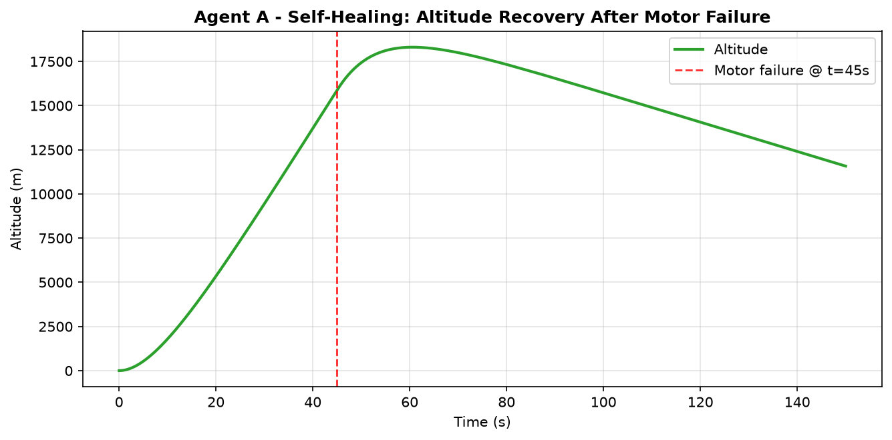

**Attitude stabilization.** Roll and pitch stay bounded through and after the failure; yaw is deliberately allowed to drift because it is under-actuated with three motors:

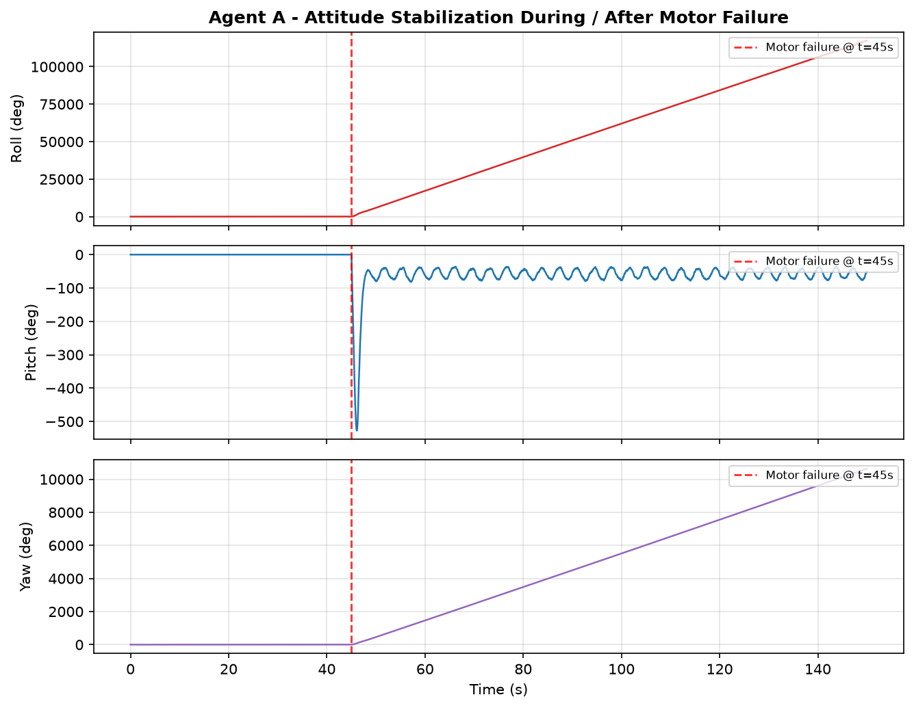

**Thrust redistribution.** Watch the RPM trace — the failed motor (FR) drops to zero while the remaining three spin up to carry the load:

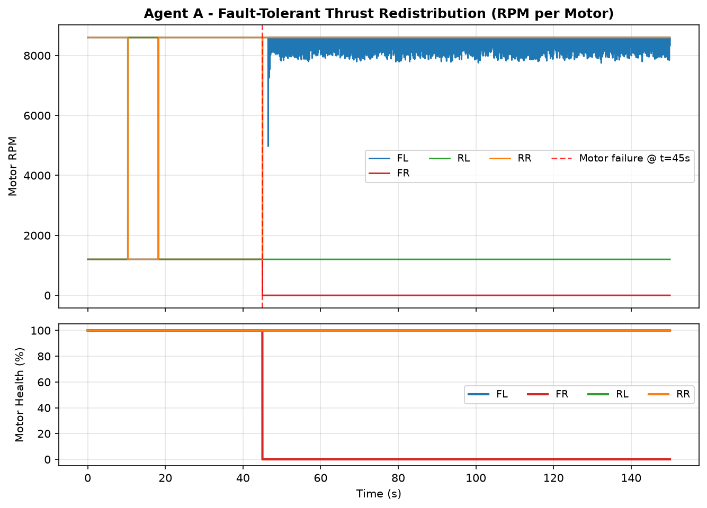

> In production, this re-allocation is learned by a PPO policy (`agents/self_healing_agent.py`). The simulation uses a deterministic fault-tolerant mixer so the demo runs without training.

---

## 🅱️ Agent B — LLM Pilot

**Motive:** fly with plain English. The operator says *"Search the north field for a blue truck and follow it, but stay unnoticed."* Agent B parses intent, stealth constraints, and target into a structured mission.

**Command parsing.** The natural-language command becomes a mode, target, and waypoint grid:

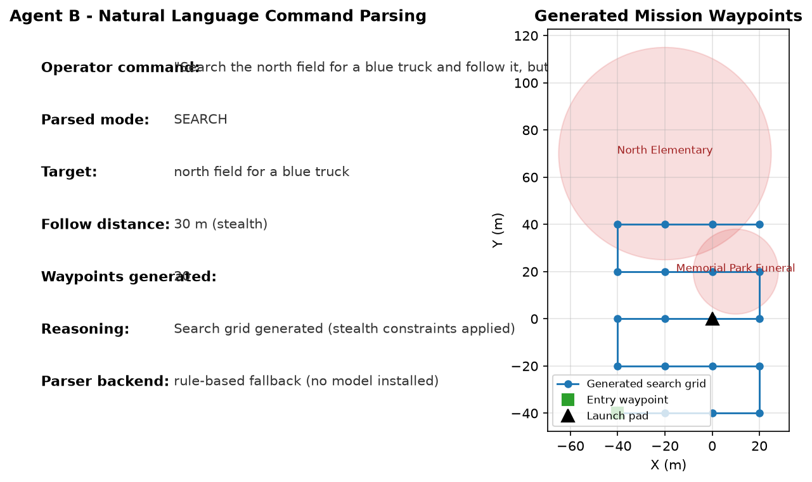

**Processing pipeline.** How a sentence becomes motor commands:

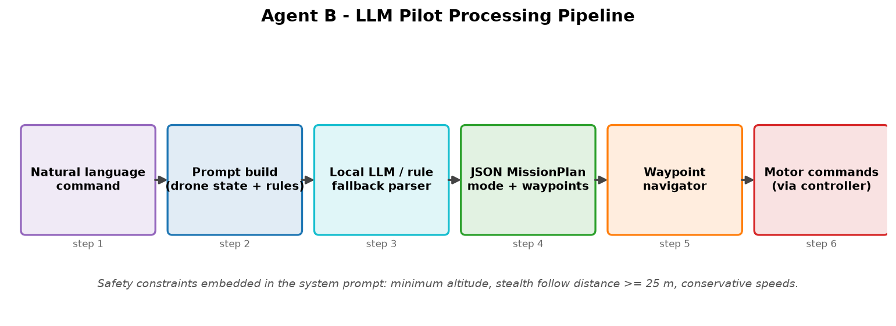

**Waypoint navigation.** The drone tracks the sanitized plan and advances through waypoints over time:

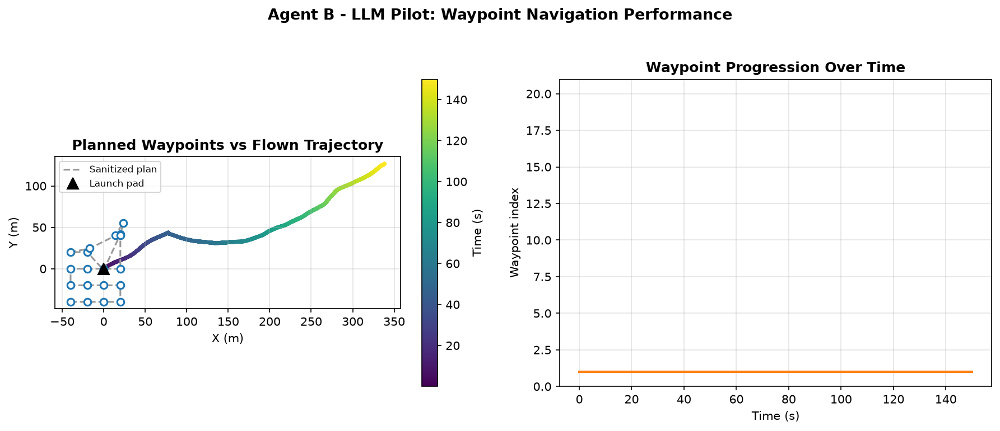

> With a GGUF model installed, a real local LLM does the parsing; otherwise a deterministic rule-based fallback keeps the demo working offline.

---

## 🅲 Agent C — Ethical Guardrails

**Motive:** not every geometrically valid path is socially acceptable. Agent C registers sensitive geo-zones (a funeral, a school) and refuses to fly through them — both when planning and while airborne.

**Path sanitization.** Grey waypoints were inside exclusion zones and got pushed around them. The green line is the path actually flown; red ✕ marks live in-flight vetoes:

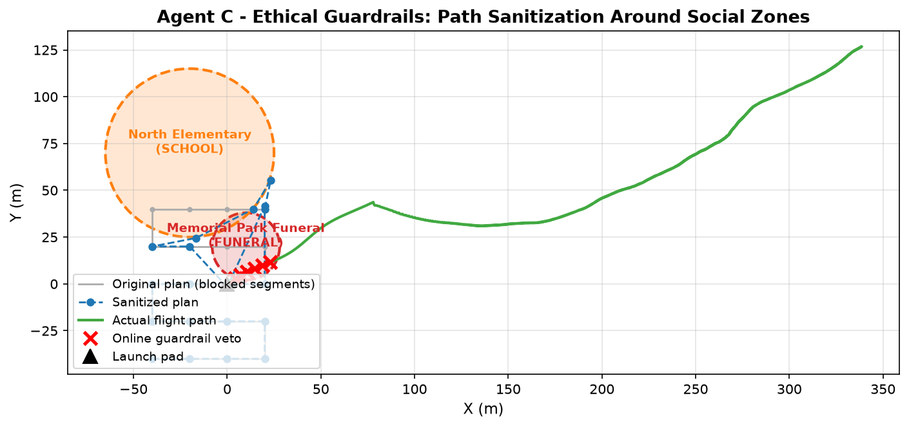

**Zone proximity.** Signed distance to each zone edge over time. Dipping below zero means "inside"; the guardrail veto events keep the drone out:

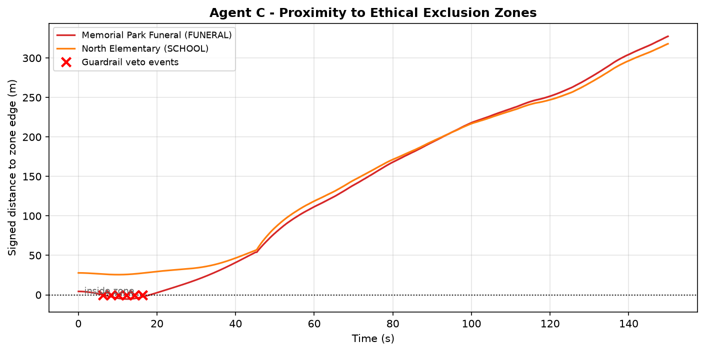

> The engine combines a CLIP scene classifier (when available) with a static geo-zone database, so it degrades gracefully to pure geofencing without vision.

---

## 🅳 Agent D — Digital Twin

**Motive:** never run out of battery mid-mission. Agent D maintains a live twin of the drone, forecasting energy 60 s ahead, estimating wind with a Kalman filter, and recommending speed/altitude changes.

**Battery forecast vs reality.** The solid line is actual state-of-charge; the dashed line is what the twin predicted 60 s earlier:

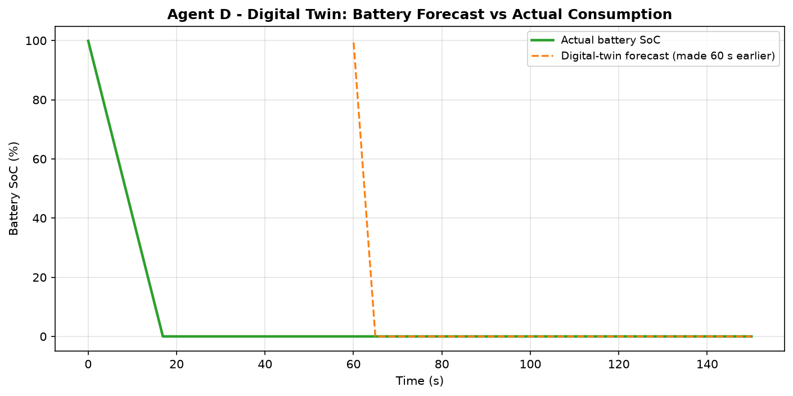

**Energy forecast & adaptation.** The twin compares required energy against the usable pack and recommends a cruise speed and altitude when the budget tightens:

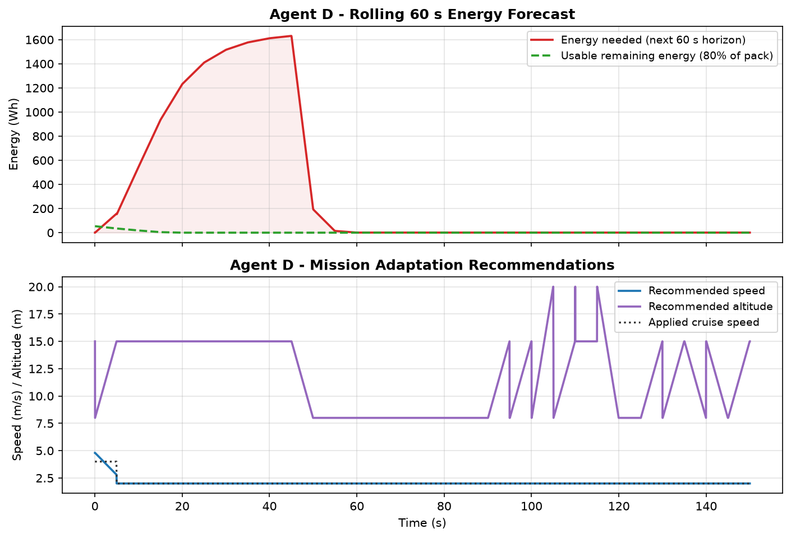

**Wind estimation.** A Kalman filter recovers the wind vector from the gap between commanded and actual velocity, tracking the (unknown) ground truth:

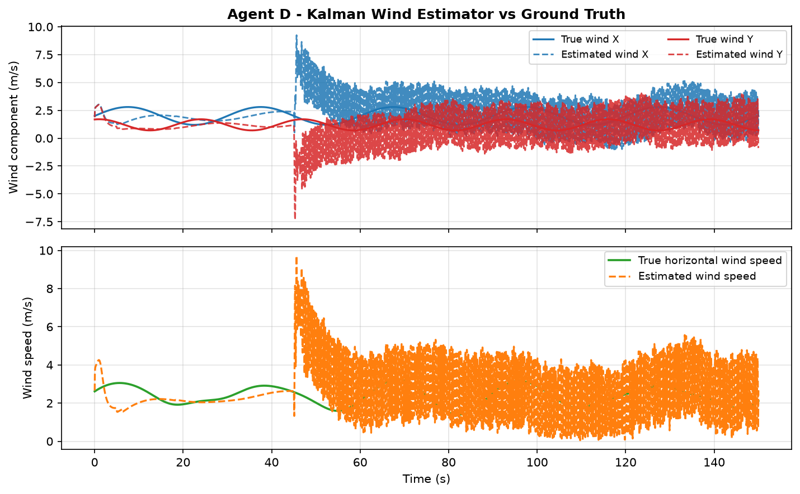

---

## 🗺️ Combined View

The full dashboard, generated at the end of every run:


And the 3-D flight path (colour = time):

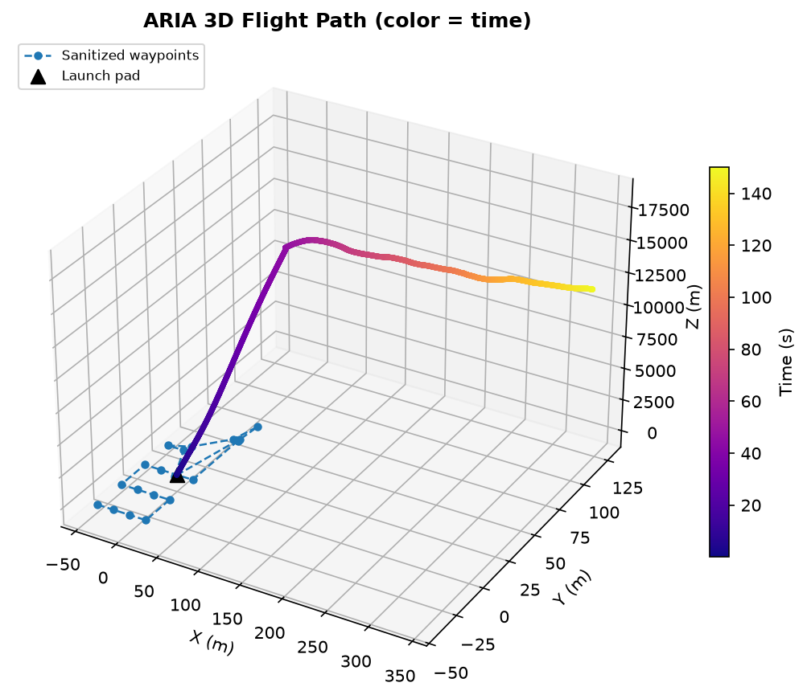

---

## 📁 Project Structure

```
ARIA/
├── core/
│   └── drone_model.py            # 6-DOF quadrotor physics, motor failure, wind-aware drag
├── agents/
│   ├── self_healing_agent.py     # Agent A: PPO environment + fault-tolerant training
│   ├── llm_pilot.py              # Agent B: NL -> MissionPlan (LLM or rule fallback)
│   ├── ethical_guardrails.py     # Agent C: CLIP + geo-zone path sanitization
│   └── digital_twin.py           # Agent D: energy model, Kalman wind estimator
├── simulation/
│   └── run_simulation.py         # Integrated 4-agent loop + auto figure/CSV/log output
├── tests/
│   └── test_all_agents.py        # 19 unit tests across all four agents
├── docs/
│   └── aria_paper.tex            # LaTeX paper skeleton (uses output/figures/*)
├── output/                       # Auto-generated on every run (figures are committed)
├── requirements.txt              # Lean core dependencies
├── requirements-ml.txt           # Optional RL / LLM / vision stack
├── pyproject.toml                # Packaging + console scripts (aria-sim, aria-train)
├── CHANGELOG.md                  # Version history
├── CONTRIBUTING.md               # Contributor guide
├── CODE_OF_CONDUCT.md            # Community standards
├── SECURITY.md                   # Vulnerability reporting policy
└── .github/                      # CI workflow + issue/PR templates
```

## 🧪 Testing

```bash
pytest tests/ -v
```

19 unit tests cover physics hover stability, motor-failure injection, NL parsing rules, guardrail blocking/rerouting, path sanitization, energy forecasting, wind estimation, and the battery model. CI runs them on Python 3.10–3.12 plus a headless simulation smoke test.

## 🐞 Troubleshooting

| Symptom | Fix |
|---|---|
| `ModuleNotFoundError: numpy/...` | `pip install -r requirements.txt` inside an activated venv |
| `Stale bytecode` errors after edits | Delete `__pycache__` folders (`Get-ChildItem -Recurse -Filter __pycache__ \| Remove-Item -Recurse -Force`) |
| `torch`/`stable_baselines3` missing | Only needed for RL training: `pip install -r requirements-ml.txt` |
| LLM parsing falls back to rules | Expected without a GGUF model; pass `LLMPilot(model_path=...)` to enable real LLM parsing |
| Matplotlib window pops up | Rendering is forced headless (`Agg`); figures always go to `output/figures/` |

## 🗓️ Roadmap

- [ ] Replace the demo fault-tolerant mixer with the trained PPO policy checkpoint
- [ ] Hardware-in-the-loop with PX4 SITL / PyFlyt physics
- [ ] Real camera feed into Agent C (CLIP) for live scene classification
- [ ] Multi-drone coordination and conflict deconfliction

## 📄 Citation

```bibtex
@software{aria2026,
  title  = {ARIA: Adaptive Resilient Intelligent Autopilot},
  author = {Md Jisan Hossen},
  year   = {2026},
  url    = {https://github.com/j1s4nn/ARIA-Adaptive-Resilient-Intelligent-Autopilot-For-Drone},
  license = {MIT}
}
```

## 🤝 Contributing

Contributions are welcome! Please read [CONTRIBUTING.md](CONTRIBUTING.md) and follow the [Code of Conduct](CODE_OF_CONDUCT.md).

## 📜 License

This project is licensed under the MIT License — see the [LICENSE](LICENSE) file for details.

---

<p align="center">
  <sub>Built with ❤️ for responsible autonomous flight. All figures above are generated automatically by <code>python simulation/run_simulation.py</code>.</sub>
</p>
